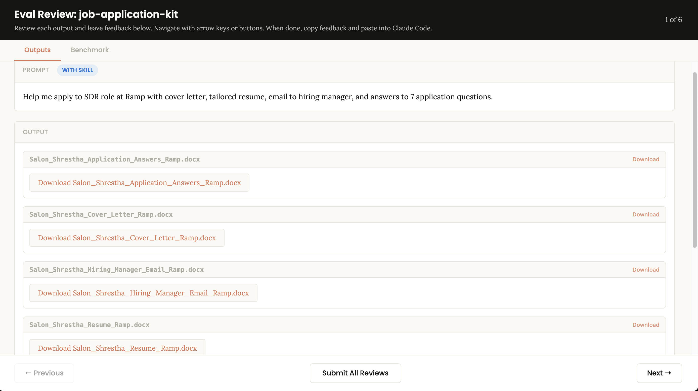

# 🚀 AI Job Application Kit

> ⚡ I used this to generate 10+ job applications in under 1 hour.

👉 Try it now: Copy the prompt below and run it in Claude or ChatGPT

---

---

## 🔥 What This Does

Turn 1 resume into **10+ tailored job applications in minutes** using AI.

No more rewriting resumes. No more staring at blank cover letters.

This system generates:

- 🔥 Tailored resumes (per job)
- ✉️ Cover letters that match the role
- 💬 Outreach emails to hiring managers
- 📈 Application answers (auto-generated)

---

## ⚡ How It Works

1. Paste your resume  
2. Paste a job description  
3. Run the prompt  
4. Get a full application instantly  

---

## 📋 Copy Prompt

Open `job-application-kit.skill` and copy everything inside.

Paste it into Claude or ChatGPT to start using.

---

## 💡 Why This Is Different

Most people:
- Apply to 2–5 jobs/day  
- Rewrite everything manually  
- Get low response rates  

With this:
👉 Apply to **10–20 jobs/day with personalization**

---

## 📂 Files

- `job-application-kit.skill` → Main prompt  
- `SKILL.md` → Readable version  

---

## 🔥 Example Output

**Input:**
- Resume + SDR job at Ramp  

**Output:**
- Resume (tailored)
- Cover letter  
- Hiring manager email  
- Application answers  

⏱️ Time: ~60 seconds

---

## 📈 Pro Tip

Don’t just apply.

Use the generated email to:
- DM hiring managers  
- Email recruiters  
- Stand out instantly  

---

## 🧠 Built With

- Claude  
- ChatGPT  

---

## ⭐ If this helps you

Star the repo or share it — helps more people land jobs faster.

---

## ⚠️ Disclaimer

Always review outputs before sending.
